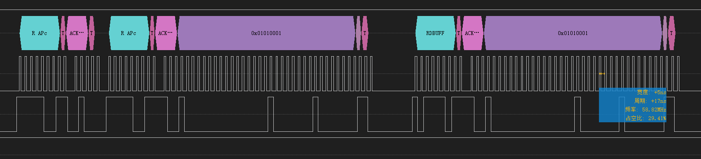

# HFLink

完全使用FPGA实现的高速DAP

## 硬件能力：

|                                 | HFLink Plus        | 敬请期待 |
| ------------------------------- | ------------------ | -------- |
| **硬件规格：**                  |                    |          |
| **Power supply**                | USB                |          |
| **Download speed into RAM**     | 3867KB/s@60MHz SWD |          |
| **Max. target interface speed** | 60MHz              |          |
| **Max. SWO speed** | 100MHz | |
| **Max. VCOM speed/baudrate**    | 15 MBd             |          |
| **Max. SPI interface speed** | 30MHz | |
| **Supported target voltage**    | 1.65 V - 5 V        |          |
| **Ethernet**                    | ❌️                  |          |
| **USB**                         | ✅️                  |          |
| **WiFi**                        | ❌️                  |          |
| **目标接口：**                  |                    |          |
| **SWD**                         | ✅️                  |          |
| **JTAG**                        | ✅️                  |          |
| **VCOM**                        | ✅️                  |          |

## SWD/JTAG:

最大时钟60MHz，时钟连续均匀，支持时序延迟补偿，带宽接近理论最大值

注：逻辑分析仪触发电平和采样率问题导致占空比和频率显示有微小偏差

## LED:

支持两种模式可在上位机随意切换

- 默认模式
  1. 红色：目标电压低
  2. 绿色：目标电压正常
  3. 黄色：复位信号低
  4. 熄灭/不规律闪烁：DAP正在执行命令，熄灭时间表示执行时间
- CMSIS-DAP模式
  1. 绿色：空闲
  2. 蓝色：已连接
  3. 紫色：运行中

## SWO:

四倍过采样最高100M波特率，使用跳变沿对齐时间极大提高波特率误差容忍

NRZ模式支持小数分频，波特率计算公式 `3200M/n (n>=32)`

Manchester支持大容差无需小数分频，波特率计算公式`200M/n (n>=2)`

## TODO：

- VTRG电压&5V电流读取 ⬅️需开发上位机
- SPI ⬅️需开发上位机
- 线路延迟自标定⬅️需开发上位机

## 构建&下载方法：

1. 打开高云FPGA工程，调整include路径配置
2. 重新生成M1 IP核，其他IP核不需要生成
3. 综合生成FPGA比特流
4. 编译MCU代码自动生成合并MCU程序的比特流文件`bitstream.bin`
5. 高云下载器设置`Debugging/Temporary Mode` -> `Set ExFlash QE For Arora V`使能Flash的Quad模式（仅需一次）
6. 高云下载器设置`External Flash Mode Arora V` -> `exFlash Erase,Program,Verify Arora V`进行外部Flash下载